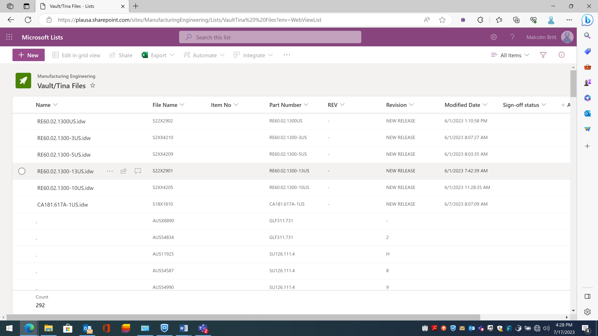
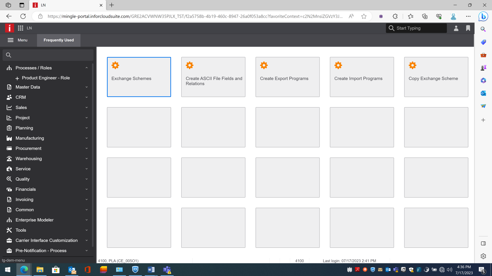

# Plasser American Internship (Summer 2023)

This folder includes images and documentation from my internship in the Manufacturing Engineering Department at Plasser American.

## Responsibilities
- Performed system scanning using Kali Linux tools.
- Built automated workflows in Microsoft Power Automate using triggers, loops, variables, and conditions.
- Extracted data from incoming emails and updated SharePoint lists.
- Organized and cleaned Bill of Materials (BOM) data for engineering staff.
- Assisted with testing and troubleshooting workflow functionality.

## Images
Below are images from my internship experience:

